```{r, echo=FALSE, message=FALSE, warning=FALSE}
# pacotes
library(tidyverse)
library(knitr)
library(kableExtra)
library(readxl)
library(ggplot2)
library(dplyr)
library(purrr)
library(patchwork)
```

```{r, echo=FALSE, message=FALSE, warning=FALSE}
# dados
dados_rras_2024 <- read_excel("f2_tabelas/dados_rras_2024.xlsx")
matriz_coef <- read_excel("f2_tabelas/matriz_correlacao.xlsx")
matriz_p <- read_excel("f2_tabelas/matriz_p_valor_correlacao.xlsx")

# transformações necessárias
dados_rras_num <- dados_rras_2024 |>
  select(-RRAS) |>
  rename(
    tx_PP = taxa_PP,
    tx_PPel = taxa_PPel_por_NV,
    tx_PPes = taxa_PPes_por_NV,
    rz_mort_mat = 'Razão de Mortalidade materna oficial 2024',
    IDH_2022 = 'IDH 2022',
    porc_exclusivas_SUS = '% de mulheres de 10-49 anos usuárias exclusivas do SUS 2024',
    cob_pop_AB = 'CObertura populacional de atenção básica 2024',
    cob_pop_SF = 'Cobertura populacional com equipes de Saúde da Família 2020',
    porc_mais_7_pre_natal = '% de Mulheres com mais de 7 consultas de pré natal 2024',
    porc_pre_natal_precoce = '% de mulheres com inicio do pré-natal precoce (<12 semanas) 2024',
    porc_pre_natal_adequado = '% de mulheres con número adequado de consultas de pré-natal para a idade gestacional no parto',
    tx_mort_fetal = 'taxa de mortalidade fetal 2024 (por  1000 NV)',
    porc_obitos_fetais_evitaveis = 'Porcentagem de óbitos fetais potencialmente evitáveis'
  ) 
```

# Métodos

Para a realização deste estudo, foram utilizados dados provenientes das bases oficiais do Sistema de Informação sobre Nascidos Vivos (SINASC), com foco nos dados de parturientes residentes no Estado de São Paulo, no ano de 2024. Realizando associações com dados fornecidos pelo Departamento de Gestão Interfederativa e Participativa (DGIP) da Secretaria Executiva (SE) do Ministério da Saúde (MS), e disponibilizados pelo Departamento de Monitoramento, Avaliação e Disseminação de Informações Estratégicas em Saúde (DEMAS) da Secretaria de Informação e Saúde Digital (SEIDIGI) [@infoms], também foi possível separar os registros em suas respectivas Redes Regionais de Atenção à Saúde (RRAS). A partir disso, realizou-se uma limpeza nos dados para identificar os casos em que a idade gestacional era maior ou igual a 22 semanas ou, nos casos em que não havia informação sobre a idade gestacional, identificar os casos em que o peso do recém-nascido era maior que 500 gramas. Dessa maneira, obteve-se os dados gerais dos nascidos vivos do Estado de São Paulo nos anos de 2012.

Para identificar os partos prematuros, aplicou-se um filtro de idade gestacional aos dados de nascidos vivos. Foram classificados como parto prematuro (PP) todos os nascimentos com idade gestacional entre 22 e 36 semanas. Na etapa seguinte, para distinguir entre partos prematuros espontâneos (PPes) e eletivos (PPel), foram utilizadas as variáveis STTRABPART, que indica a ocorrência de trabalho de parto induzido, e STCESPARTO, que informa se foi realizada cesárea antes do início do trabalho de parto.

Assim, caso não houvesse trabalho de parto induzido e não houvesse cesárea antes do início do trabalho de parto, os dados eram classificados como partos prematuros espontâneos. Os demais casos em que havia alguma informação sobre o trabalho de parto foram classificados como partos prematuros eletivos. A tabela a seguir apresenta detalhadamente a classificação dos tipos de parto.

```{r table1, echo=FALSE, message=FALSE, warnings=FALSE}
#| label: tabela-classificacao
#| tbl-cap: "Tabela 1: Classificação do tipo de parto."

tabela_classificacao <- data.frame(
  `Trabalho de parto induzido` = c(
    "Não", "Não", "Sim", "Sim",
    "Sem informação", "Sem informação", "Sem informação",
    "Não", "Sim"
  ),
  `Cersárea antes do trabalho de parto` = c(
    "Não", "Sim", "Não", "Sim",
    "Sem informação", "Não", "Sim",
    "Sem informação", "Sem informação"
  ),
  `Resultado do parto` = c(
    "Espontâneo", "Eletivo", "Eletivo", "Eletivo",
    "Não tem como avaliar", "Não tem como avaliar", "Eletivo",
    "Não tem como avaliar", "Eletivo"
  ),
  check.names = FALSE
)

kable(tabela_classificacao, align = "ccc") |>
  kable_styling(
    bootstrap_options = c("striped", "hover", "condensed"),
    full_width = FALSE)

```

As porcentagens utilizadas ao longo do relatório foram calculadas diretamente a partir dos valores absolutos obtidos nas filtragens anteriores. A porcentagem de partos prematuros em relação ao total de nascidos vivos foi obtida dividindo-se o número total de partos prematuros pelo total de nascidos vivos e multiplicando o resultado por 100. De maneira semelhante, esse processo foi aplicado para calcular as porcentagens de partos prematuros eletivos e partos prematuros espontâneos em relação ao total de nascidos vivos e ao total de partos prematuros, criando diferentes taxas para a análise. Empregando esse procedimento para todos esses casos, foi possível adicionar ao banco de dados informações relativas aos anos no Estado de São Paulo como um todo e também informações relativas aos anos e às RRAS separadamente.

A análise das associações entre as variáveis foi realizada por meio do coeficiente de correlação de Spearman (rho ou $\rho$). A escolha desse método se justifica por se tratar de uma medida não paramétrica, adequada para avaliar relações monotônicas entre variáveis, sem a necessidade de assumir normalidade na distribuição dos dados.

Foram calculadas as correlações entre os indicadores de prematuridade e variáveis sociodemográficas, de cobertura assistencial e de condições de saúde. Adicionalmente, foram obtidos os valores de p para cada correlação, permitindo a avaliação da significância estatística das associações observadas.

## Correlação de Spearman

O coeficiente de correlação de Spearman avalia a força e a direção da associação entre duas variáveis através de uma relação monotônica. Trata-se de um método não paramétrico, pois ele não exige a suposição de que os dados sigam uma distribuição normal, sendo baseado nos postos dos valores ao invés dos valores brutos [@Spearman_1904].

O teste avalia as seguintes hipóteses estatísticas:

-   Hipótese nula ($H_0$): Não há associação monotônica entre as duas variáveis (as variáveis são independentes).

-   Hipótese alternativa ($H_1$): Existe uma associação monotônica entre as variáveis (os postos de uma variável tendem a aumentar ou diminuir em relação aos postos da outra).

Dentre os resultados fornecidos por esta análise, destacam-se as seguintes medidas:

-   O Coeficiente: Esta medida de associação varia entre -1 e 1. Um valor de 1 indica uma correlação monotônica positiva perfeita, -1 indica uma correlação monotônica negativa perfeita, e 0 indica a ausência de associação monotônica.

-   Significância (p-valor): Representa a probabilidade de observar uma correlação tão forte quanto a calculada caso a hipótese nula fosse verdadeira. Assim como em outros testes de associação, considera-se o resultado estatisticamente significativo quando o p-valor é menor que 0.05.

Para a realização das análises no ambiente R, utiliza-se a função nativa `cor.test()`, especificando o argumento `method = "spearman"`. Esta função calcula tanto o coeficiente de correlação quanto a significância estatística necessária para a interpretação dos dados.

Os resultados são apresentados no relatório destacando o coeficiente de correlação, que indica a magnitude da associação, e o p-valor correspondente, onde p < 0.05 é considerado significativo e p < 0.01 é considerado altamente significativo para rejeitar a independência entre as variáveis. Além disso, para fins interpretativos neste relatório, consideraram-se as magnitudes de correlação sugeridas por Mukaka [-@mukaka2012guide] como as mais relevantes para apresentação dos resultados, tal que:

```{r table1, echo=FALSE, message=FALSE, warnings=FALSE}
#| label: tabela-magnitude-correlacao
#| tbl-cap: "Tabela 2: Interpretação dos coeficientes de correlação."
dados_correlacao <- data.frame(
  `Valor da correlação` = c(
    "|ρ| < 0.3",
    "0.3 ≤ |ρ| < 0.5",
    "0.5 ≤ |ρ| < 0.7",
    "0.7 ≤ |ρ| < 0.9",
    "|ρ| ≥ 0.9"
  ),
  Interpretacao = c(
    "Desprezível",
    "Fraca",
    "Moderada",
    "Forte",
    "Muito forte"
  ),
  check.names = FALSE
)

kable(dados_correlacao, 
      format = "html",
      escape = FALSE,  
      align = "cc") %>%
  kable_styling(bootstrap_options = c("striped", "hover", "condensed"),
                full_width = FALSE)
```

## Variáveis consideradas nas análise

Foram incluídas na análise variáveis relacionadas à prematuridade, características socioeconômicas e indicadores de assistência à saúde. A descrição das variáveis, suas respectivas abreviações e anos de referência está apresentada na Tabela 3.

Entre os indicadores de prematuridade, consideraram-se a taxa de partos prematuros, a taxa de partos prematuros eletivos e a taxa de partos prematuros espontâneos, sendo esses indicadores relativos ao ano de 2024.

No que se refere aos indicadores de saúde materna e fetal, foram analisadas a razão de mortalidade materna, a taxa de mortalidade fetal e a porcentagem de óbitos fetais potencialmente evitáveis, todos referentes ao ano de 2024. Como indicador socioeconômico, utilizou-se o Índice de Desenvolvimento Humano, calculado em 2022.

Além disso, foram incluídos indicadores de acesso e qualidade da atenção à saúde, como a cobertura populacional da atenção básica (2024), a cobertura da Estratégia Saúde da Família (2020), a porcentagem de mulheres com mais de sete consultas de pré-natal (2024), o início precoce do pré-natal (2024), a adequação do pré-natal (2024) e a porcentagem de usuárias exclusivas do Sistema Único de Saúde (2024).

Todas essas variáveis foram analisadas no nível das Redes Regionais de Atenção à Saúde (RRAS), considerando, majoritariamente, o ano de 2024.

```{r table2, echo=FALSE}
#| label: tabela-descricao
#| tbl-cap: "Tabela 3: Descrição das variáveis utilizadas na análise."

tabela_variaveis <- data.frame(
  Variável = c(
    "Taxa de partos prematuros",
    "Taxa de partos prematuros eletivos",
    "Taxa de partos prematuros espontâneos",
    "Razão de mortalidade materna",
    "Taxa de mortalidade fetal",
    "Porcentagem de óbitos fetais potencialmente evitáveis",
    "Índice de Desenvolvimento Humano",
    "Cobertura populacional da atenção básica",
    "Cobertura da Estratégia Saúde da Família",
    "Porcentagem de mulheres com mais de sete consultas de pré-natal",
    "Início precoce do pré-natal",
    "Adequação do pré-natal",
    "Porcentagem de usuárias exclusivas do SUS"
  ),
  Abreviação = c(
    "tx_PP",
    "tx_PPel",
    "tx_PPes",
    "rz_mort_mat",
    "tx_mort_fetal",
    "porc_obitos_fetais_evitaveis",
    "IDH_2022",
    "cob_pop_AB",
    "cob_pop_SF",
    "porc_mais_7_pre_natal",
    "porc_pre_natal_precoce",
    "porc_pre_natal_adequado",
    "porc_exclusivas_SUS"
  ),
  Ano = c(
    2024, 2024, 2024,
    2024, 2024, 2024,
    2022,
    2024, 2020,
    2024, 2024, 2024, 2024
  )
)

kable(tabela_variaveis, align = "lcc") |>
  kable_styling(bootstrap_options = c("striped", "hover", "condensed"), 
                full_width = F)
```

# Análise de correlação

## Visão geral dos indicadores 

Apresentam-se a seguir os gráficos e tabelas de correlação, assim como os gráficos de dispersão e suas respectivas interpretações, com ênfase nos indicadores relacionados à prematuridade.

```{r fig1, echo=FALSE, warning=FALSE, message=FALSE}
#| fig-cap: "Figura 1: Matriz de correlação dos indicadores."
#| fig-align: "center"
knitr::include_graphics("f3_graficos/corrplot.jpg")
```

```{r, echo=FALSE, warning=FALSE, message=FALSE}
# # formato longo
# coef_longo <- matriz_coef %>%
#   rename(Variavel1 = 1) %>%
#   pivot_longer(cols = -Variavel1, names_to = "Variavel2", values_to = "rho")
# 
# # transformando a tabela
# tabela_p <- matriz_p %>%
#   rename(Variavel1 = 1) %>%
#   pivot_longer(cols = -Variavel1, names_to = "Variavel2", values_to = "p_valor") %>%
#   left_join(coef_longo, by = c("Variavel1", "Variavel2")) %>%
#   filter(p_valor < 0.05,
#          p_valor > 0,
#          Variavel1 < Variavel2) %>%
#   mutate(
#     Indicadores = paste(Variavel1, "x", Variavel2),
#     Classificacao = case_when(
#       p_valor < 0.01 ~ "Altamente significativa",
#       p_valor < 0.05 ~ "Significativa"
#     )
#   ) %>%
#   select(Indicadores, rho, p_valor, Classificacao) %>%
#   arrange(p_valor) %>%
#   mutate(
#     rho = round(rho, 4),
#     p_valor = round(p_valor, 4)
#   )
```

```{r, echo=FALSE, message=FALSE, warning=FALSE, include=FALSE}
# plots <- pmap(list(tabela_p$Indicadores, 
#                    strsplit(tabela_p$Indicadores, " x ")), 
#               function(label, vars) {
#                 
#   v1 <- vars[1]
#   v2 <- vars[2]
#   
#   ggplot(cbind(dados_rras_num, RRAS = dados_rras_2024$RRAS), aes_string(x = v1, y = v2)) +
#     geom_point(size = 3, color = "steelblue", alpha = 0.7) +
#     geom_text(aes_string(label = "RRAS"), vjust = -0.5, size = 3.5) +
#     geom_smooth(method = "lm", color = "firebrick", se = FALSE) + 
#     labs(title = paste("Relação:", label),
#          x = v1,
#          y = v2) +
#     theme_minimal()
# })
# 
# # baixando os gráficos
# for (i in seq_along(plots)) {
#   caminho_arquivo <- paste0("f3_graficos/grafico_", i, ".jpg")
# 
#   jpeg(filename = caminho_arquivo, 
#        width = 2000, 
#        height = 2000, 
#        res = 300)
#   
#   print(plots[[i]])
#   
#   dev.off()
# }
```

```{r, echo=FALSE, warning=FALSE, message=FALSE}
# formato longo
coef_longo <- matriz_coef |>
  rename(Variavel1 = 1) |>
  pivot_longer(cols = -Variavel1, names_to = "Variavel2", values_to = "rho")

# transformando a tabela
tabela_p <- matriz_p |>
  rename(Variavel1 = 1) |>
  pivot_longer(cols = -Variavel1, names_to = "Variavel2", values_to = "p_valor") |>
  left_join(coef_longo, by = c("Variavel1", "Variavel2")) |>
  filter(Variavel1 != Variavel2) 

tabela_aux <- tabela_variaveis |>
  select(Variavel2 = Abreviação,
         Variável)

tabela_final <- left_join(tabela_p, tabela_aux) |>
  select(-Variavel2) |>
  mutate(rho = round(rho, 4), p_valor = round(p_valor, 4)) |>
  select(Variável, p_valor, rho, Variavel1)|>
  rename(
    Indicador = Variável,
    `Valor-p` = p_valor,
    `Coeficiente de correlação` = rho
  ) |>
  mutate(
    Indicador = factor(Indicador, levels = c(
    "Taxa de partos prematuros",
    "Taxa de partos prematuros eletivos",
    "Taxa de partos prematuros espontâneos",
    "Razão de mortalidade materna",
    "Taxa de mortalidade fetal",
    "Porcentagem de óbitos fetais potencialmente evitáveis",
    "Índice de Desenvolvimento Humano",
    "Cobertura populacional da atenção básica",
    "Cobertura da Estratégia Saúde da Família",
    "Porcentagem de mulheres com mais de sete consultas de pré-natal",
    "Início precoce do pré-natal",
    "Adequação do pré-natal",
    "Porcentagem de usuárias exclusivas do SUS"
  ))
  ) |>
  arrange(Indicador)

```

## Indicador taxa de partos prematuros

```{r table3, echo=FALSE, warning=FALSE, message=FALSE}
#| label: tabela-valor-p-tx-PP
#| tbl-cap: "Tabela 4: Valores p e coeficientes de correlação de Spearman entre o indicador taxa de prematuridade e os indicadores sociodemográficos, de cobertura assistencial e de condições de saúde."

tabela_final |>
  filter(Variavel1 == "tx_PP") |>
  select(-Variavel1) |>
  kable(align = "llcc") |>
  kable_styling(bootstrap_options = c("striped", "hover", "condensed"), 
                full_width = F)
```

```{r, echo=FALSE, warning=FALSE, message=FALSE}
df <- dados_rras_2024 |>
  rename(
    tx_PP = taxa_PP,
    tx_PPel = taxa_PPel_por_NV,
    tx_PPes = taxa_PPes_por_NV,
    rz_mort_mat = 'Razão de Mortalidade materna oficial 2024',
    IDH_2022 = 'IDH 2022',
    porc_exclusivas_SUS = '% de mulheres de 10-49 anos usuárias exclusivas do SUS 2024',
    cob_pop_AB = 'CObertura populacional de atenção básica 2024',
    cob_pop_SF = 'Cobertura populacional com equipes de Saúde da Família 2020',
    porc_mais_7_pre_natal = '% de Mulheres com mais de 7 consultas de pré natal 2024',
    porc_pre_natal_precoce = '% de mulheres com inicio do pré-natal precoce (<12 semanas) 2024',
    porc_pre_natal_adequado = '% de mulheres con número adequado de consultas de pré-natal para a idade gestacional no parto',
    tx_mort_fetal = 'taxa de mortalidade fetal 2024 (por  1000 NV)',
    porc_obitos_fetais_evitaveis = 'Porcentagem de óbitos fetais potencialmente evitáveis'
  )
```

```{r, echo=FALSE, warning=FALSE, message=FALSE}
#| fig-cap: "Figura 2: Dispersão entre a taxa de partos prematuros e os demais indicadores."
#| fig-align: "center"

vars_x <- setdiff(names(df), c("RRAS", "tx_PP"))

df_long <- df |>
  pivot_longer(
    cols = all_of(vars_x),
    names_to = "variavel",
    values_to = "valor"
  ) |>
  mutate(
    variavel = factor(variavel, levels = c(
    "tx_PP",
    "tx_PPel",
    "tx_PPes",
    "rz_mort_mat",
    "tx_mort_fetal",
    "porc_obitos_fetais_evitaveis",
    "IDH_2022",
    "cob_pop_AB",
    "cob_pop_SF",
    "porc_mais_7_pre_natal",
    "porc_pre_natal_precoce",
    "porc_pre_natal_adequado",
    "porc_exclusivas_SUS"
  ))
  )

ggplot(df_long, aes(x = valor, y = tx_PP)) +
  geom_point(alpha = 0.7, size = 2) +
  geom_smooth(method = "lm", se = FALSE, linewidth = 0.8) +
  facet_wrap(~variavel, scales = "free_x", ncol = 4) +
  labs(
    x = "Valor do indicador",
    y = "Taxa de partos prematuros"
    # title = "Dispersão entre a Taxa de partos prematuros e os demais indicadores"
  ) 

```

Levando em consideração as correlações não desprezíveis, identificou-se que a taxa de partos prematuros apresentou forte correlação positiva com a taxa de partos prematuros eletivos ($\rho = 0.7276$) e, apesar de estar no limite de uma correlação fraca, apresentou também correlação positiva com a taxa de partos prematuros espontâneos ($\rho = 0.3090$). Resultado esse esperado, pois as taxa de partos prematuros eletivos e espontâneos estão contidas dentro da taxa de partos prematuros gerais. As demais variáveis apresentaram correlações desprezíveis com o indicador de taxa de partos prematuros gerais ($\rho < 0.3$).

De maneira a complementar os coeficientes de correlação, é possível observar, pelos gráficos de dispersão da Figura 2, a aparente falta de padrão e formato claro de associação entre a taxa de partos prematuros e as demais variáveis, onde a linha de tendência geral se apresenta de maneira quase reta na horizontal, com exceção da taxa de partos prematuros eletivos, onde os pontos estão dispersos mais próximos à linha de tendência crescente. A taxa de partos prematuros espontâneos não apresenta uma tendência clara em seu gráfico de dispersão.

Em visto disso, analisou-se também as mesmas correlações para os indicadores de prematuridade específicos (eletivos e espontâneos), com o intuito de averiguar a existência de relações entre esses indicadores e as demais variáveis. 

## Indicador taxa de partos prematuros eletivos

```{r table4, echo=FALSE, warning=FALSE, message=FALSE}
#| label: tabela-valor-p-tx-PPel
#| tbl-cap: "Tabela 5: Valores p e coeficientes de correlação de Spearman entre o indicador taxa de prematuridade eletiva e os indicadores sociodemográficos, de cobertura assistencial e de condições de saúde."

tabela_final |>
  filter(Variavel1 == "tx_PPel") |>
  select(-Variavel1) |>
  kable(align = "llcc") |>
  kable_styling(bootstrap_options = c("striped", "hover", "condensed"), 
                full_width = F)
```

```{r, echo=FALSE, warning=FALSE, message=FALSE}
#| fig-cap: "Figura 3: Dispersão entre a taxa de partos prematuros eletivos e os demais indicadores."
#| fig-align: "center"

vars_x <- setdiff(names(df), c("RRAS", "tx_PPel"))

df_long <- df |>
  pivot_longer(
    cols = all_of(vars_x),
    names_to = "variavel",
    values_to = "valor"
  ) |>
  mutate(
    variavel = factor(variavel, levels = c(
    "tx_PP",
    "tx_PPel",
    "tx_PPes",
    "rz_mort_mat",
    "tx_mort_fetal",
    "porc_obitos_fetais_evitaveis",
    "IDH_2022",
    "cob_pop_AB",
    "cob_pop_SF",
    "porc_mais_7_pre_natal",
    "porc_pre_natal_precoce",
    "porc_pre_natal_adequado",
    "porc_exclusivas_SUS"
  ))
  )

ggplot(df_long, aes(x = valor, y = tx_PPel)) +
  geom_point(alpha = 0.7, size = 2) +
  geom_smooth(method = "lm", se = FALSE, linewidth = 0.8) +
  facet_wrap(~variavel, scales = "free_x", ncol = 4) +
  labs(
    x = "Valor do indicador",
    y = "Taxa de partos prematuros eletivos"
    # title = "Dispersão entre a Taxa de partos prematuros eletivos e os demais indicadores"
  ) 

```

Para além do observado na análise da taxa de partos prematuros gerais, encontrou-se aqui outra correlação não deprezível para a taxa de partos prematuros eletivos, sendo ela a correlação negativa com a razão de mortalidade materna ($\rho = -0.3086$). Essa correlação traz indícios de que uma maior taxa de partos prematuros eletivos leva a uma menor razão de mortalidade materna (menor número de óbitos maternos). No entanto, como é uma correlação fraca e próxima de uma correlação considerada desprezível, deve se tomar bastante cuidado na consideração dessa interpretação. As demais variáveis apresentaram correlações desprezíveis com o indicador de taxa de partos prematuros gerais ($\rho < 0.3$).

Assim como anteriormente, é possível observar graficamente na Figura 3 a dispersão entre a taxa de partos prematuros eletivos e a taxa de partos prematuros, enquanto suas demais relações apresentam uma aparente falta de padrão e de formato claro de associação, onde a linha de tendência geral se apresenta de maneira quase reta na horizontal. Mesmo a relação com a razão de mortalidade materna apresentando uma linha de tendência levemente inclinada para baixo, é difícil afirmar, graficamente, que existe essa relação.

## Indicador taxa de partos prematuros espontâneos

```{r table5, echo=FALSE, warning=FALSE, message=FALSE}
#| label: tabela-valor-p-tx-PPes
#| tbl-cap: "Tabela 6: Valores p e coeficientes de correlação de Spearman entre o indicador taxa de prematuridade espontânea e os indicadores sociodemográficos, de cobertura assistencial e de condições de saúde."

tabela_final |>
  filter(Variavel1 == "tx_PPes") |>
  select(-Variavel1) |>
  kable(align = "llcc") |>
  kable_styling(bootstrap_options = c("striped", "hover", "condensed"), 
                full_width = F)
```

```{r, echo=FALSE, warning=FALSE, message=FALSE}
#| fig-cap: "Figura 4: Dispersão entre a taxa de partos prematuros espontâneos e os demais indicadores."
#| fig-align: "center"

vars_x <- setdiff(names(df), c("RRAS", "tx_PPes"))

df_long <- df |>
  pivot_longer(
    cols = all_of(vars_x),
    names_to = "variavel",
    values_to = "valor"
  ) |>
  mutate(
    variavel = factor(variavel, levels = c(
    "tx_PP",
    "tx_PPel",
    "tx_PPes",
    "rz_mort_mat",
    "tx_mort_fetal",
    "porc_obitos_fetais_evitaveis",
    "IDH_2022",
    "cob_pop_AB",
    "cob_pop_SF",
    "porc_mais_7_pre_natal",
    "porc_pre_natal_precoce",
    "porc_pre_natal_adequado",
    "porc_exclusivas_SUS"
  ))
  )

ggplot(df_long, aes(x = valor, y = tx_PPes)) +
  geom_point(alpha = 0.7, size = 2) +
  geom_smooth(method = "lm", se = FALSE, linewidth = 0.8) +
  facet_wrap(~variavel, scales = "free_x", ncol = 4) +
  labs(
    x = "Valor do indicador",
    y = "Taxa de partos prematuros espontâneos"
    # title = "Dispersão entre a Taxa de partos prematuros espontâneos e os demais indicadores"
  ) 

```

Diferentemente das demais taxas, a taxa de partos prematuros espontâneos apresentou mais correlações com os outros indicadores socioeconômicos e de assistência à saúde. Além da correlação observada entre essa taxa e a taxa de partos prematuros gerais, observa-se também as correlações fracas com a taxa de mortalidade fetal ($\rho = -0.3532$), com o início precoce do pré-natal ($\rho = 0.3318$), com a porcentagem de usuárias exclusivas do SUS	($\rho = 0.3397$), com a adequação do pré-natal ($\rho = 0.4788$) e com a cobertura populacional da atenção básica ($\rho = 0.4788$). Além disso, obteve-se duas correlações positivas moderadas com a porcentagem de mulheres com mais de sete consultas de pré-natal ($\rho = 0.5995$) e a cobertura da Estratégia Saúde da Família ($\rho = 0.6016$). Esses resultados trazem indícios de que, no contexto da taxa de prematuridade espontânea, o maior acesso às consultas e ao sistema público favorece a detecção de gestações de risco

Assim como os dados dos coeficientes de correlação indicam, é possível observar um maior número de linhas de tendência inclinadas negativa e positivamente nos gráficos de dispersão da Figura 4 em comparação com os gráficos de dispersão das demais taxas de partos prematuros, corroborando os resultados trazidos pela correlação de Spearman.

<!-- Observa-se inicialmente na Figura 1 e na Tabela 2 uma forte correlação positiva entre a taxa de partos prematuros totais e a taxa de partos prematuros eletivos ($\rho$ = 0,73), indicando que a variação da prematuridade total é fortemente influenciada pelos partos prematuros de natureza eletiva. Em contrapartida, a correlação entre prematuridade total e prematuridade espontânea foi mais fraca ($\rho$ = 0,31), sugerindo menor contribuição relativa desse componente. -->

<!-- A taxa de partos prematuros espontâneos apresentou correlações positivas moderadas a fortes com indicadores de cobertura e acesso à atenção primária, como a cobertura da Estratégia Saúde da Família ($\rho$ = 0,60), cobertura da atenção básica ($\rho$ = 0,48) e proporção de mulheres com mais de sete consultas de pré-natal ($\rho$ = 0,60). Por outro lado, a taxa de prematuridade espontânea apresentou correlação negativa com a taxa de mortalidade fetal ($\rho$ = -0,35). -->

<!-- Os resultados do teste de Spearman indicam que a taxa de partos prematuros totais apresentou correlação estatisticamente significativa apenas com a taxa de partos prematuros eletivos (p \< 0,001), evidenciando que a variação da prematuridade total é fortemente influenciada por esse componente. -->

<!-- De forma semelhante, a taxa de partos prematuros eletivos apresentou correlação significativa apenas com a prematuridade total, não sendo observadas associações estatisticamente significativas com os demais indicadores analisados. -->

<!-- Por outro lado, a taxa de partos prematuros espontâneos apresentou correlações estatisticamente significativas com indicadores de acesso e qualidade da atenção à saúde, incluindo a cobertura da atenção básica (p = 0,044), a cobertura da Estratégia Saúde da Família (p = 0,008), a proporção de mulheres com mais de sete consultas de pré-natal (p = 0,009) e a adequação do pré-natal (p = 0,044). -->

<!-- Além disso, avaliando as demais variáveis, verificou-se uma associação positiva altamente significativa ($\rho$ = 0.9293; p = 0.0000) entre a proporção de mulheres com mais de 7 consultas de pré-natal e a proporção de pré-natal adequado, indicando que maiores percentuais de realização de consultas estão relacionados a maior adequação do acompanhamento pré-natal. De forma consistente, a cobertura populacional de atenção básica apresenta associação positiva altamente significativa com a cobertura por equipes de Saúde da Família ($\rho$ = 0.7888; p = 0.0001), evidenciando que maiores níveis de uma cobertura estão relacionados a maiores níveis da outra. -->

<!-- Por outro lado, observou-se que o IDH de 2022 apresenta associação negativa altamente significativa com a proporção de usuárias exclusivas do SUS ($\rho$ = −0.7176; p = 0.0008), indicando que valores mais elevados de IDH estão relacionados a menores proporções dessa população. Em contrapartida, a cobertura de atenção básica mostra associação positiva altamente significativa com a proporção de usuárias exclusivas do SUS ($\rho$ = 0.6105; p = 0.0071), sugerindo que maiores níveis de cobertura estão associados a maiores proporções de usuárias exclusivas do SUS. -->

<!-- Por fim, pode-se observar que a proporção de início precoce do pré-natal apresenta associação negativa significativa com a razão de mortalidade materna ($\rho$ = −0.5480; p = 0.0186), assim como a proporção de mulheres com mais de 7 consultas de pré-natal também apresenta associação negativa significativa com a taxa de mortalidade fetal ($\rho$ = −0.5067; p = 0.0319), indicando que o pré-natal iniciado precocemente está relacionado a menores razões de morte materna e que mais de 7 consultas de pré-natal estão relacionadas a menores taxas de mortalidade fetal. -->

<!-- A seguir, tem-se os gráficos de dispersão das relações entre as variáveis com correlações significativas de acordo com a correlação de Spearman, com o intuito de complementar as análises realizadas através da correlação de Spearman. -->


<!-- 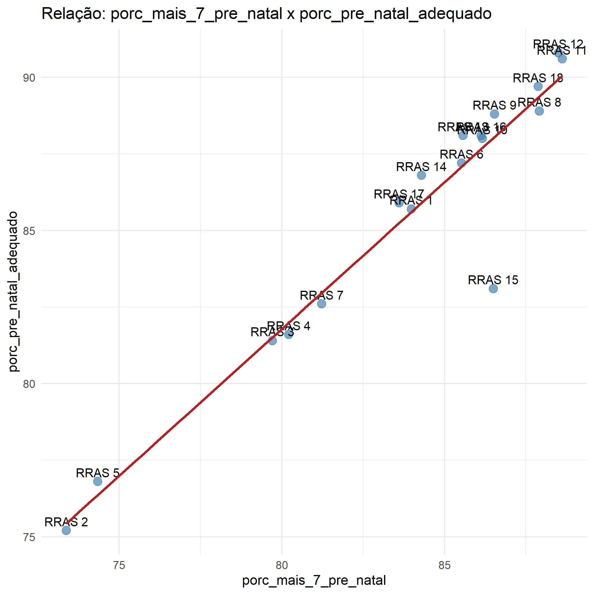{#fig-corr1} -->

<!-- O gráfico de dispersão entre a porcentagem de mulheres com mais de 7 consultas de pré-natal e a porcentagem de pré-natal adequado revela uma associação positiva altamente significativa, perceptível pela reta de tendência geral acentuada, indicando que maiores percentuais de consultas estão diretamente relacionados a uma maior adequação do acompanhamento nas redes regionais. As RRAS 11, 12 e 18 apresentam os maiores índices em ambos os indicadores, situando-se no extremo superior direito da distribuição, enquanto as RRAS 2 e 5 ocupam o extremo oposto com os menores valores registrados. Nota-se que a RRAS 15 apresenta um desvio em relação à tendência geral. -->

<!-- 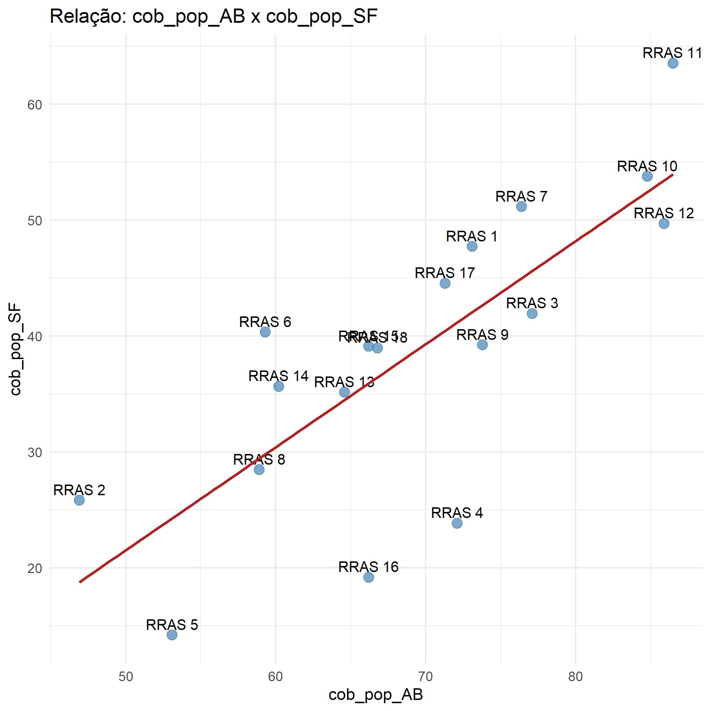{#fig-corr2} -->

<!-- A análise da cobertura populacional de atenção básica em relação à cobertura por equipes de Saúde da Família demonstra uma associação positiva altamente significativa. As RRAS 11, 10 e 12 destacam-se pelas maiores porcentagens de cobertura em ambas as modalidades. Em contrapartida, as RRAS 4, 5 e 16 apresentam coberturas de Saúde da Família que se posicionam bem abaixo da linha de tendência central. -->


<!-- 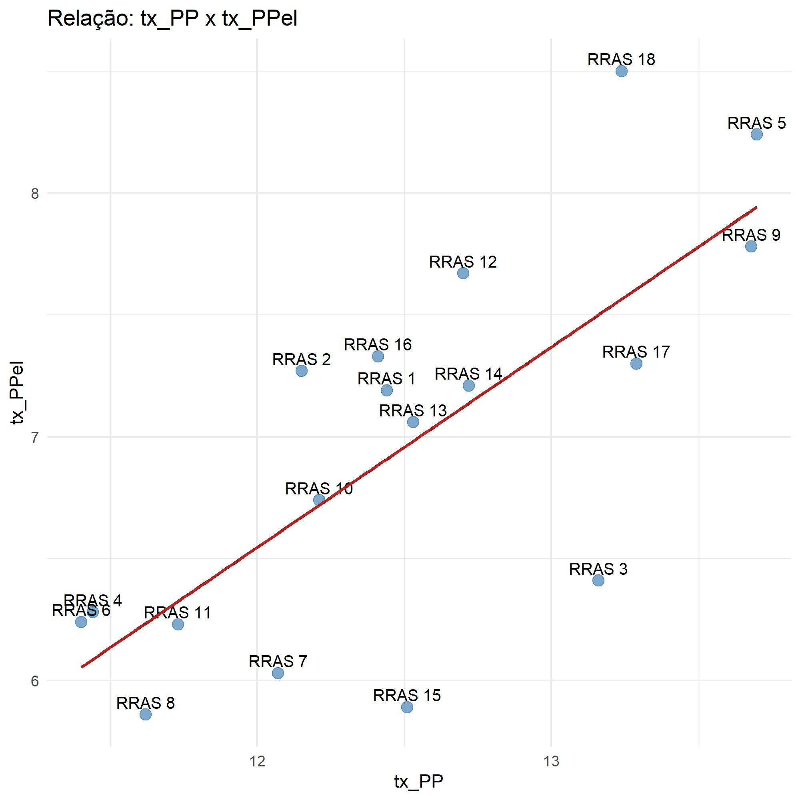{#fig-corr3} -->

<!-- Na relação entre a taxa de partos prematuros e a taxa de partos prematuros eletivos, as RRAS 18 e 5 registram as taxas mais elevadas para ambos os indicadores, ao passo que as RRAS 8, 4 e 6 concentram-se nos menores valores tanto de prematuridade total quanto de prematuridade eletiva. -->

<!-- 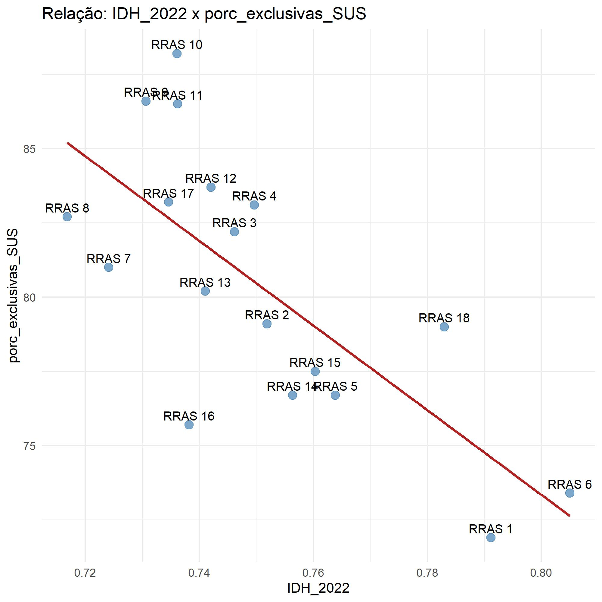{#fig-corr4} -->

<!-- Na Figura 4, observa-se que as RRAS 6 e 1 ocupam o quadrante inferior direito do gráfico, caracterizado pelo maior IDH e menor dependência exclusiva do SUS, enquanto as RRAS 10, 8 e 11 situam-se no extremo oposto, apresentando menores índices de IDH acompanhados das maiores proporções de usuárias exclusivas. -->

<!-- 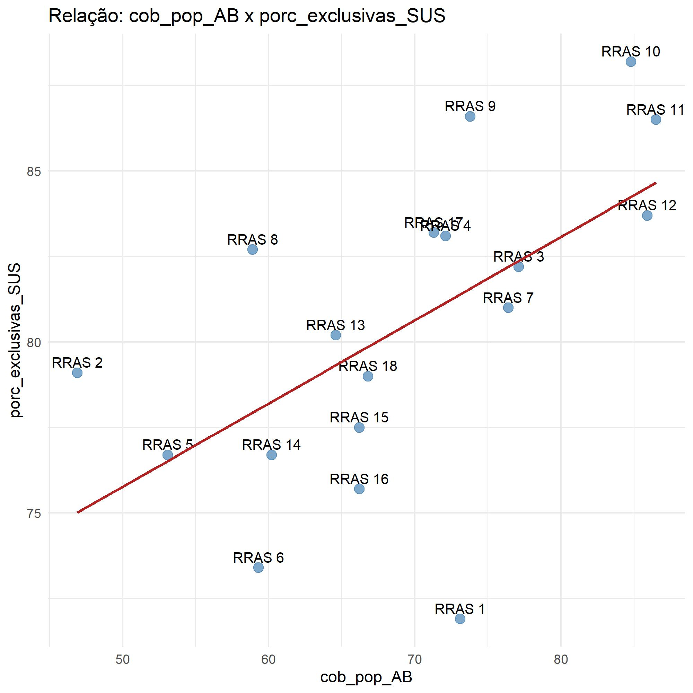{#fig-corr5} -->

<!-- Na Figura 5, percebe-se que as RRAS 10, 11 e 12 encontram-se no quadrante superior direito, apresentando altos índices em ambos os indicadores simultaneamente. Em contrapartida, a RRAS 1 configura-se como um desvio à tendência geral da amostra, mantendo uma cobertura de atenção básica superior a 70%, porém registrando a menor proporção de usuárias exclusivas do SUS entre todas as redes regionais. -->

<!-- 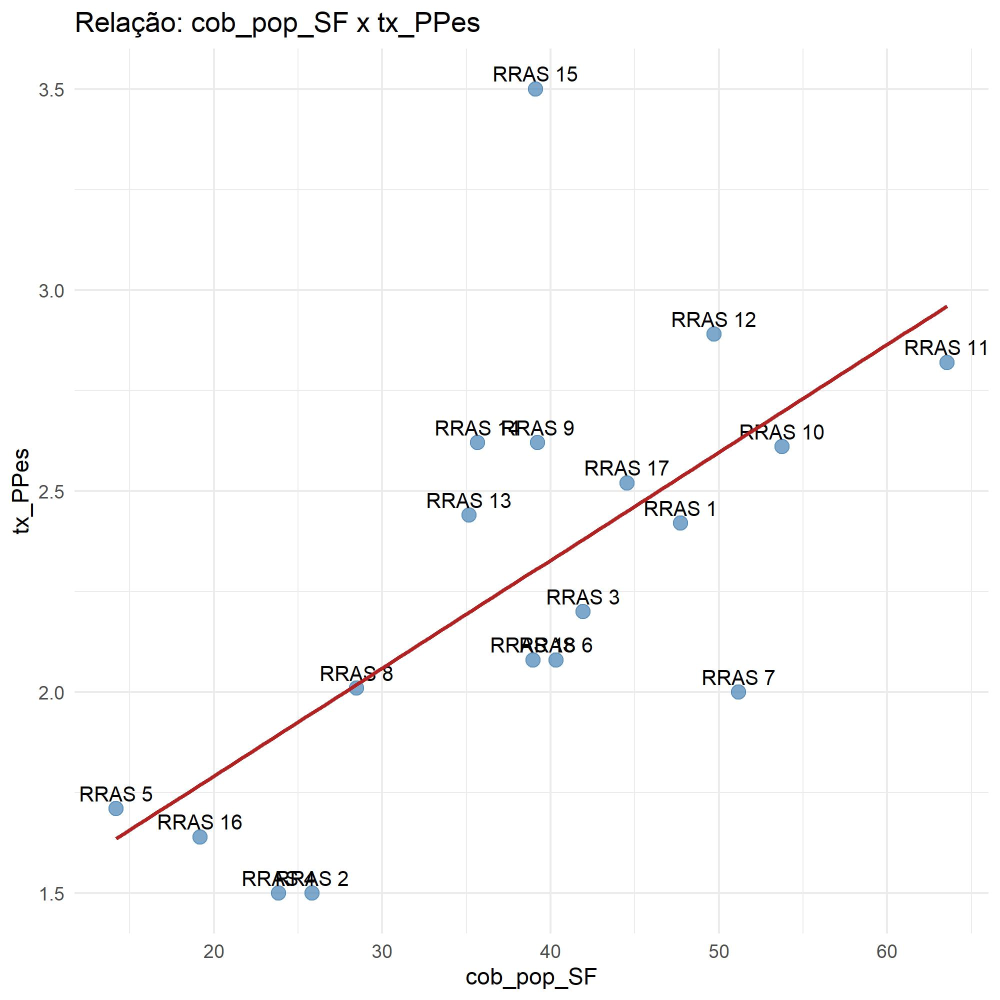{#fig-corr6} -->

<!-- Na dispersão entre a cobertura populacional da Estratégia Saúde da Família e a taxa de partos prematuros espontâneos, a RRAS 11 posicionou-se no extremo superior de cobertura e taxa, enquanto as RRAS 2, 4 e 5 apresentam os menores valores para ambos os indicadores. A RRAS 15 destaca-se como um ponto atípico, apresentando a maior taxa de prematuridade espontânea do conjunto de dados, apesar de possuir uma cobertura de Saúde da Família em patamar intermediário. -->

<!-- 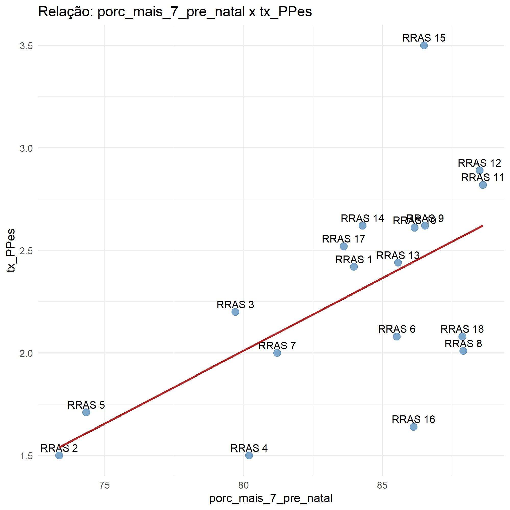{#fig-corr7} -->

<!-- Pelo gráfico, percebe-se que as RRAS 11 e 12 posicionam-se com altos valores em ambos os indicadores, enquanto a RRAS 2 apresenta os menores índices tanto de consultas quanto de prematuridade espontânea. A RRAS 15 aparece novamente como um ponto atípico na distribuição, apresentando a maior taxa de prematuridade espontânea entre todas as regiões, apesar de possuir um percentual de consultas superior a 85%. -->

<!-- 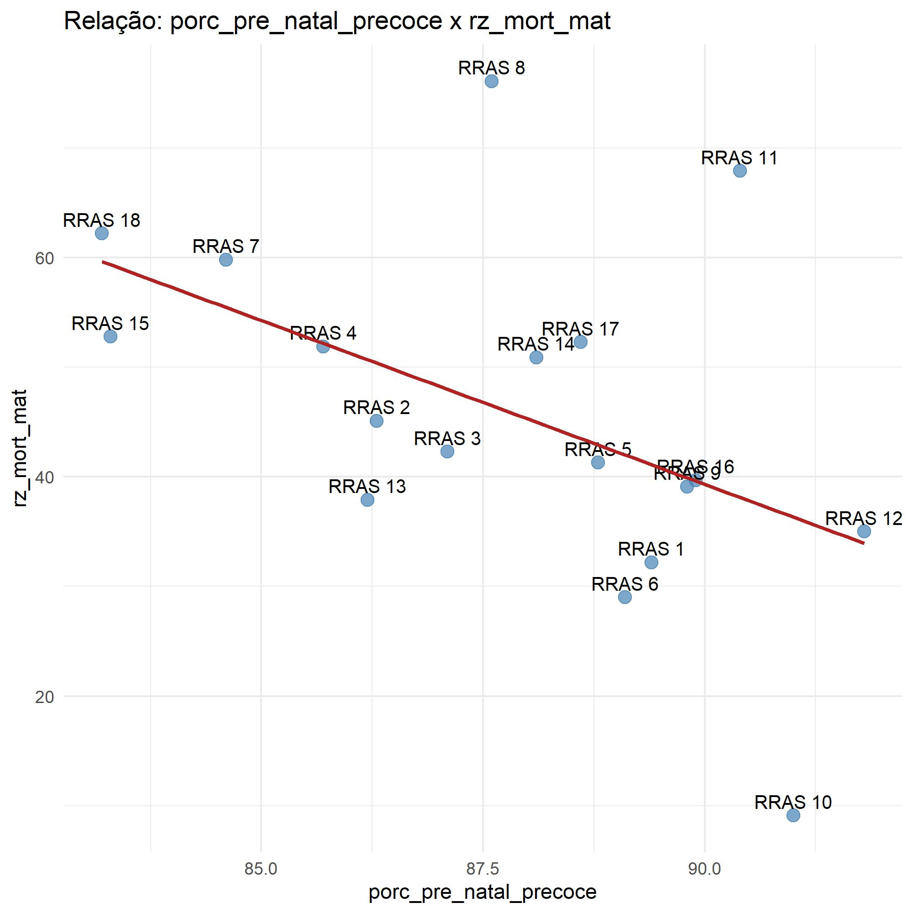{#fig-corr8} -->

<!-- O gráfico de dispersão da relação entre porcentagens de pré-natal precoce e razão de mortalidade materna mostra que as RRAS 18, 15 e 7 concentram-se no quadrante superior esquerdo, com menores percentuais de início precoce e razões de mortalidade mais elevadas. Por outro lado, a RRAS 10 apresenta o maior percentual de início precoce do pré-natal e a menor razão de mortalidade materna do conjunto de dados, posicionando-se no extremo inferior direito da tendência observada. -->

<!-- 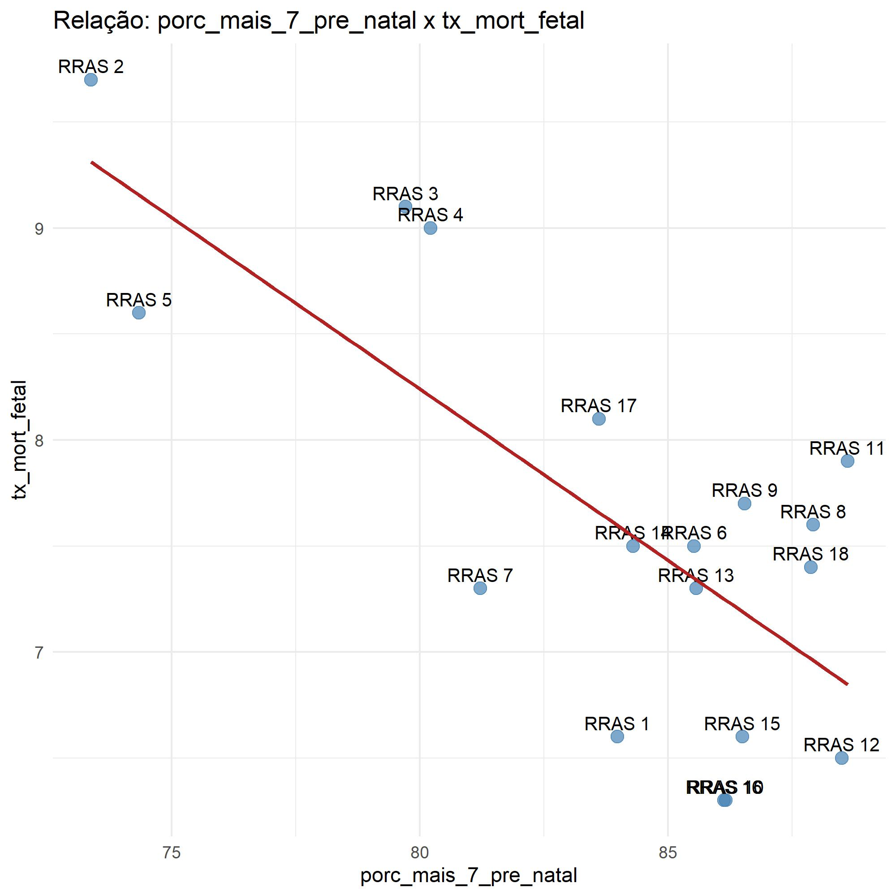{#fig-corr9} -->

<!-- No gráfico de dispersão, a RRAS 2 destaca-se no extremo superior esquerdo, registrando a maior taxa de mortalidade fetal acompanhada pelo menor percentual de realização de mais de 7 consultas. No extremo oposto, as RRAS 10, 12, 16 e 15 situam-se no quadrante inferior direito, apresentando alta cobertura de consultas e as menores taxas de mortalidade fetal observadas no período. -->

<!-- 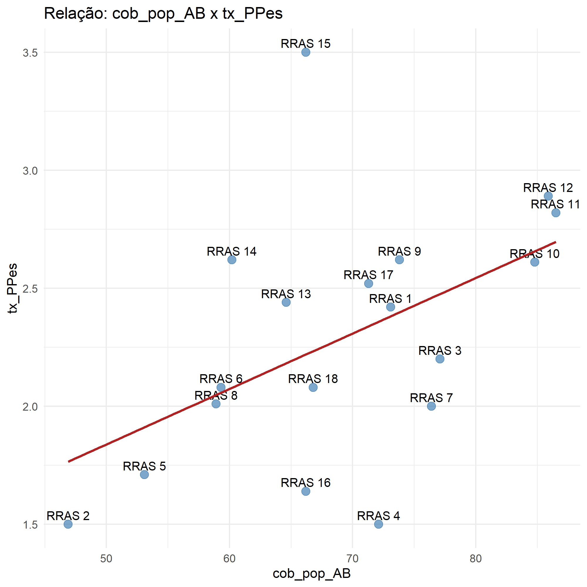{#fig-corr10} -->

<!-- No gráfico da Figura 10, é visto que as RRAS 11 e 12 posicionam-se no extremo superior direito da tendência, enquanto as RRAS 2 e 5 ocupam o extremo inferior esquerdo. A RRAS 15 destaca-se como um ponto isolado no topo da distribuição, apresentando a maior taxa de prematuridade espontânea do estado para um nível intermediário de cobertura assistencial, ao passo que as RRAS 4 e 16 registram taxas de prematuridade espontânea reduzidas apesar de possuírem coberturas de atenção básica superiores a 70%. -->

<!-- 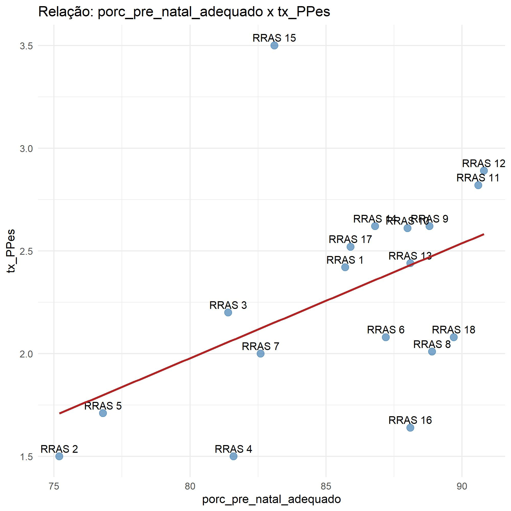{#fig-corr11} -->

<!-- Pelo gráfico de dispersão da relação entre a porcentagem de pré-natais adequados e a taxa de prematuridade espontânea, as RRAS 11 e 12 situam-se no quadrante superior direito, combinando altos índices de adequação de pré-natal e taxas elevadas de prematuridade espontânea, enquanto a RRAS 2 posiciona-se no extremo oposto com os menores valores para ambas as variáveis. A RRAS 15 configura-se novamente como o principal desvio da tendência central, mantendo a taxa mais elevada de prematuridade espontânea da amostra, enquanto a RRAS 16 apresenta uma das menores taxas observadas. -->

