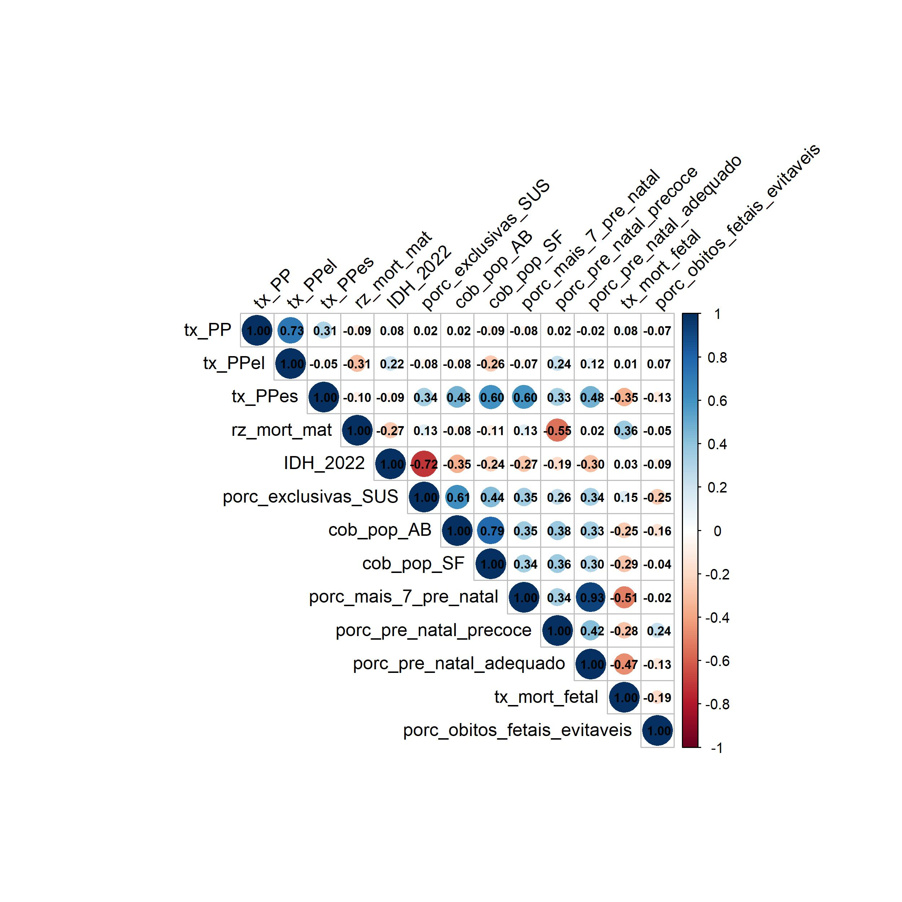
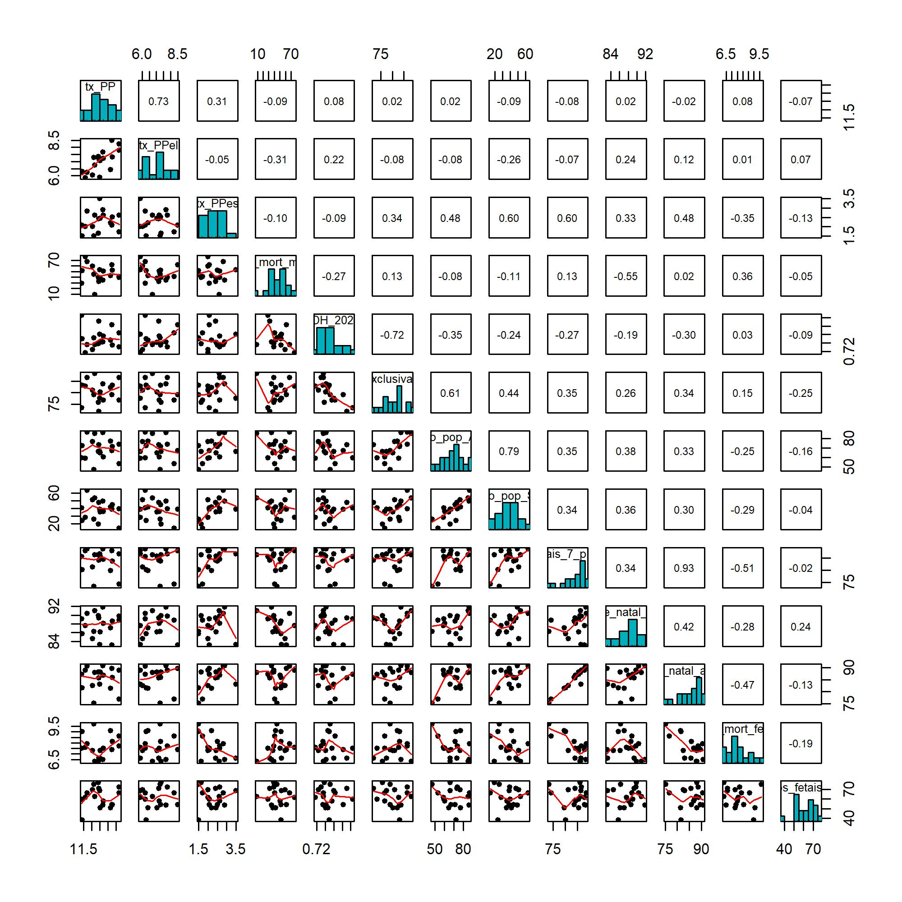

```{r, echo=FALSE}
knitr::opts_chunk$set(echo=FALSE, message=FALSE, warning=FALSE)
```

# Métodos

Para a realização deste estudo, foram utilizados dados provenientes das bases oficiais do Sistema de Informação sobre Nascidos Vivos (SINASC), com foco nos dados de parturientes residentes no Estado de São Paulo, no ano de 2024. Realizando associações com dados fornecidos pelo Departamento de Gestão Interfederativa e Participativa (DGIP) da Secretaria Executiva (SE) do Ministério da Saúde (MS), e disponibilizados pelo Departamento de Monitoramento, Avaliação e Disseminação de Informações Estratégicas em Saúde (DEMAS) da Secretaria de Informação e Saúde Digital (SEIDIGI) [@infoms], também foi possível separar os registros em suas respectivas Redes Regionais de Atenção à Saúde (RRAS). A partir disso, realizou-se uma limpeza nos dados para identificar os casos em que a idade gestacional era maior ou igual a 22 semanas ou, nos casos em que não havia informação sobre a idade gestacional, identificar os casos em que o peso do recém-nascido era maior que 500 gramas. Dessa maneira, obteve-se os dados gerais dos nascidos vivos do Estado de São Paulo nos anos de 2012.

Para identificar os partos prematuros, aplicou-se um filtro de idade gestacional aos dados de nascidos vivos. Foram classificados como parto prematuro (PP) todos os nascimentos com idade gestacional entre 22 e 36 semanas. Na etapa seguinte, para distinguir entre partos prematuros espontâneos (PPes) e eletivos (PPel), foram utilizadas as variáveis STTRABPART, que indica a ocorrência de trabalho de parto induzido, e STCESPARTO, que informa se foi realizada cesárea antes do início do trabalho de parto.

Assim, caso não houvesse trabalho de parto induzido e não houvesse cesárea antes do início do trabalho de parto, os dados eram classificados como partos prematuros espontâneos. Os demais casos em que havia alguma informação sobre o trabalho de parto foram classificados como partos prematuros eletivos. A tabela a seguir apresenta detalhadamente a classificação dos tipos de parto.

```{r table2, echo=FALSE, message=FALSE, warnings=FALSE, results='asis'}
#| tab-label:
tab <- "
| Trabalho de parto induzido | Cersárea antes do trabalho de parto | Resultado do parto    |
|:----------------------------------------:|:--------------------------------------------:|:-------------------------:|
| Não                                      | Não                                          | Espontâneo                |
| Não                                      | Sim                                          | Eletivo                   |
| Sim                                      | Não                                          | Eletivo                   |
| Sim                                      | Sim                                          | Eletivo                   |
| Sem informação                           | Sem informação                               | Não tem como avaliar      |
| Sem informação                           | Não                                          | Não tem como avaliar      |
| Sem informação                           | Sim                                          | Eletivo                   |
| Não                                      | Sem informação                               | Não tem como avaliar      |
| Sim                                      | Sem informação                               | Eletivo                   |
: Classificação do tipo de parto
"
cat(tab)
```

As porcentagens utilizadas ao longo do relatório foram calculadas diretamente a partir dos valores absolutos obtidos nas filtragens anteriores. A porcentagem de partos prematuros em relação ao total de nascidos vivos foi obtida dividindo-se o número total de partos prematuros pelo total de nascidos vivos e multiplicando o resultado por 100. De maneira semelhante, esse processo foi aplicado para calcular as porcentagens de partos prematuros eletivos e partos prematuros espontâneos em relação ao total de nascidos vivos e ao total de partos prematuros, criando diferentes taxas para a análise. Empregando esse procedimento para todos esses casos, foi possível adicionar ao banco de dados informações relativas aos anos no Estado de São Paulo como um todo e também informações relativas aos anos e às RRAS separadamente. 

A análise das associações entre as variáveis foi realizada por meio do coeficiente de correlação de Spearman. A escolha desse método se justifica por se tratar de uma medida não paramétrica, adequada para avaliar relações monotônicas entre variáveis, sem a necessidade de assumir normalidade na distribuição dos dados.

Foram calculadas as correlações entre os indicadores de prematuridade e variáveis sociodemográficas, de cobertura assistencial e de condições de saúde. Adicionalmente, foram obtidos os valores de p para cada correlação, permitindo a avaliação da significância estatística das associações observadas.

Para fins interpretativos, consideraram-se estatisticamente significativas as correlações com p-valor inferior a 0,05.

## Variáveis utilizadas

Foram incluídas na análise variáveis relacionadas à prematuridade, características socioeconômicas e indicadores de assistência à saúde. Entre os indicadores de prematuridade, consideraram-se a taxa de partos prematuros, a taxa de partos prematuros eletivos e a taxa de partos prematuros espontâneos. No que se refere aos indicadores de saúde materna e fetal, foram analisadas a razão de mortalidade materna, a taxa de mortalidade fetal e a porcentagem de óbitos fetais potencialmente evitáveis. Como indicador socioeconômico, utilizou-se o Índice de Desenvolvimento Humano (IDH). Além disso, foram incluídos indicadores de acesso e qualidade da atenção à saúde, como a cobertura populacional da atenção básica, a cobertura da Estratégia Saúde da Família, a porcentagem de mulheres com mais de sete consultas de pré-natal, o início precoce do pré-natal (antes de 12 semanas), a adequação do pré-natal e a porcentagem de usuárias exclusivas do Sistema Único de Saúde. Todas essas variáveis foram analisadas no nível das Redes Regionais de Atenção à Saúde (RRAS) para o ano de 2024.

## Análise de correlação

Apresentam-se a seguir os gráficos de correlação e sua respectiva interpretação, com ênfase nos indicadores relacionados à prematuridade.

{#fig-corrplot}

Observa-se inicialmente na Figura 1 uma forte correlação positiva entre a taxa de partos prematuros totais e a taxa de partos prematuros eletivos ($\rho$ = 0,73), indicando que a variação da prematuridade total é fortemente influenciada pelos partos prematuros de natureza eletiva. Em contrapartida, a correlação entre prematuridade total e prematuridade espontânea foi mais fraca ($\rho$ = 0,31), sugerindo menor contribuição relativa desse componente.

A taxa de partos prematuros espontâneos apresentou correlações positivas moderadas a fortes com indicadores de cobertura e acesso à atenção primária, como a cobertura da Estratégia Saúde da Família ($\rho$ = 0,60), cobertura da atenção básica ($\rho$ = 0,48) e proporção de mulheres com mais de sete consultas de pré-natal ($\rho$ = 0,60). Por outro lado, a taxa de prematuridade espontânea apresentou correlação negativa com a taxa de mortalidade fetal ($\rho$ = -0,35).

Os resultados do teste de Spearman indicam que a taxa de partos prematuros totais apresentou correlação estatisticamente significativa apenas com a taxa de partos prematuros eletivos (p < 0,001), evidenciando que a variação da prematuridade total é fortemente influenciada por esse componente.

De forma semelhante, a taxa de partos prematuros eletivos apresentou correlação significativa apenas com a prematuridade total, não sendo observadas associações estatisticamente significativas com os demais indicadores analisados.

Por outro lado, a taxa de partos prematuros espontâneos apresentou correlações estatisticamente significativas com indicadores de acesso e qualidade da atenção à saúde, incluindo a cobertura da atenção básica (p = 0,044), a cobertura da Estratégia Saúde da Família (p = 0,008), a proporção de mulheres com mais de sete consultas de pré-natal (p = 0,009) e a adequação do pré-natal (p = 0,044).


{#fig-pairs}

A Figura 2 complementa essa análise ao apresentar o painel de dispersão entre as variáveis, permitindo observar a distribuição dos dados entre as RRAS e possíveis padrões de associação entre os indicadores analisados.

